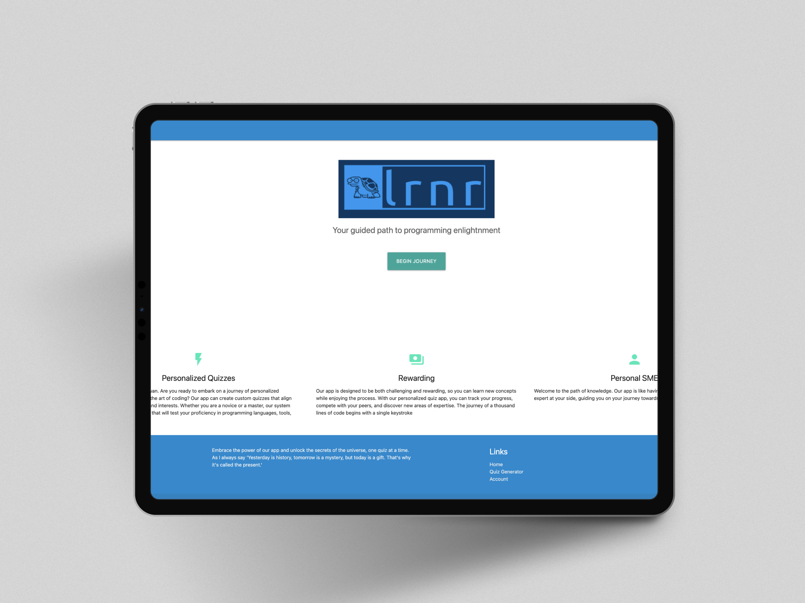

<div style="display: flex; justify-content: center; align-items: center; flex-direction: column; text-align: center; gap: 20px;">


# LRNR APP

</div>

<div style="display: flex; justify-content: center; gap: 20px;">


</div>

## 🌟 **Your Guided Path to Enlightenment**

Welcome to your personalized learning journey—a platform designed to help you expand your knowledge across any subject of interest. This app offers an engaging and rewarding experience, making learning both accessible and efficient.

⚡ Personalized Quizzes
Our app generates custom quizzes tailored to your skills and interests. Whether you're exploring science, technology, history, or any other field, the quizzes are designed to challenge your understanding and promote meaningful learning.

💰 Rewarding Experience
Track your progress and discover new areas of expertise at your own pace. Every quiz is an opportunity to deepen your knowledge and develop new skills in an engaging and structured way.

👤 Your Personal Learning Guide
The platform functions as a personalized learning assistant, providing guidance and support as you navigate various topics and expand your knowledge base.

✨ Unlock Your Full Potential
Take control of your learning journey—one quiz at a time. Begin today and make continuous growth an integral part of your routine.

## 🛠️ **Technologies Used**

This project leverages modern tools and libraries to provide an efficient and engaging learning experience:

- **React** – A powerful JavaScript library for building user interfaces.
- **Vite** – A fast development build tool that enhances performance and streamlines the development process.
- **Materialize CSS** – A modern responsive front-end framework for designing sleek and intuitive user interfaces.
- **React Router** – Enables dynamic routing for seamless navigation across the application.
- **Framer Motion** – Provides advanced animation capabilities for a more interactive user experience.
- **Styled Components** – Allows writing CSS-in-JS, making component styling more modular and maintainable.
- **Axios** – A promise-based HTTP client for handling API requests efficiently.
- **ESLint** – A tool for identifying and fixing code quality issues to ensure consistent coding standards.

## 📷 **Screen Shot**



## 🚀 **Installation and Setup**

Follow these steps to get the project up and running on your local machine:

1. **Clone the Project**
   First, clone the repository to your local machine:

   ```bash
   git clone git@github.com:iconst01/LRNR_APP.git
   cd LRNR_APP
   ```

2. **Install Dependencies**
   Install the required dependencies using npm:

   ```bash
   npm install
   ```

3. **Obtain an API Key**
   To access the AI features, you will need to obtain an API key. Visit the following link to get your key:
   [Gemini API Documentation](https://ai.google.dev/gemini-api/docs)

4. **Configure the API Key**
   Once you have the API key, create a `.env` file in the root of the project and add the following:

   ```
   VITE_API_KEY=your_api_key_here
   ```

5. **Run the Project**
   To start the development server, run:

   ```bash
   npm run dev
   ```

6. **Open in Your Browser**
   Navigate to the provided localhost URL in your browser to see the app in action.

---

### 🔄 **Contributing**

If you'd like to contribute to the project, feel free to fork the repository and create a pull request. You can fork the project by clicking the "Fork" button on the top-right of this page or using the following command:

```bash
git fork git@github.com:iconst01/LRNR_APP.git
```

---

Enjoy building and contributing to the project! 🚀

## 🚀 **Next Steps**

We hope this project serves as a valuable tool in your learning journey. Whether you're just getting started or exploring new topics, we believe this app can support your growth.

## 🛠️ **Contributing**

We welcome contributions! If you have ideas, bug fixes, or improvements, feel free to fork the repository, make your changes, and submit a pull request.

## 📬 **Contact**

For questions, suggestions, or any issues, please feel free to reach out via GitHub issues or contact us directly at info@roadtohire.org.

## 📝 **License**

This project is licensed under the [MIT License](LICENSE).

---

Keep learning, and happy coding! 🌟
